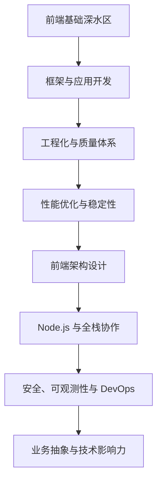

---
title: 高级前端工程师成长学习路线
created: 2026-06-06
tags:
  - 前端
  - 学习路线
  - 高级前端工程师
status: evergreen
---

# 高级前端工程师成长学习路线

> 目标：从“能独立完成业务需求的前端工程师”成长为“能负责复杂系统、推动工程质量、影响团队技术方向的高级前端工程师”。

## 0. 高级前端工程师能力画像

高级前端不只是会写页面，而是能在复杂业务与技术约束下，稳定交付高质量系统。

| 能力维度 | 具体表现 |
|---|---|
| 基础深度 | 深刻理解 JavaScript、浏览器、网络、渲染、工程化原理 |
| 框架能力 | 熟练掌握 React/Vue 等框架原理、性能优化、状态管理和组件设计 |
| 工程能力 | 能搭建脚手架、构建系统、CI/CD、质量体系、监控体系 |
| 架构能力 | 能设计大型前端应用、微前端、跨端方案、组件库、低代码/中后台平台 |
| 性能能力 | 能定位并优化加载、渲染、交互、包体积、缓存和稳定性问题 |
| 业务抽象 | 能从重复业务中抽象通用能力，沉淀平台、组件、规范和最佳实践 |
| 协作影响力 | 能做技术评审、Code Review、方案设计、带新人、推动团队共识 |

---

## 1. 学习路线总览



建议按以下 8 个阶段推进：

1. [[前端/高级前端工程师成长学习路线#阶段一：前端基础深水区|前端基础深水区]]
2. [[前端/高级前端工程师成长学习路线#阶段二：现代框架与应用开发|现代框架与应用开发]]
3. [[前端/高级前端工程师成长学习路线#阶段三：前端工程化与研发质量|前端工程化与研发质量]]
4. [[前端/高级前端工程师成长学习路线#阶段四：性能优化与用户体验|性能优化与用户体验]]
5. [[前端/高级前端工程师成长学习路线#阶段五：前端架构与复杂系统设计|前端架构与复杂系统设计]]
6. [[前端/高级前端工程师成长学习路线#阶段六：Node.js、BFF 与全栈协作|Node.js、BFF 与全栈协作]]
7. [[前端/高级前端工程师成长学习路线#阶段七：安全、稳定性与可观测性|安全、稳定性与可观测性]]
8. [[前端/高级前端工程师成长学习路线#阶段八：技术影响力与职业成长|技术影响力与职业成长]]

---

## 阶段一：前端基础深水区

### 1.1 JavaScript 核心机制

必须掌握：

- 作用域、闭包、执行上下文、变量提升
- 原型、原型链、继承、类语法本质
- this 绑定规则、call/apply/bind 实现
- 事件循环：宏任务、微任务、渲染时机
- Promise、async/await、生成器、迭代器
- 模块化：CommonJS、ESM、循环依赖、Tree Shaking
- 内存管理、垃圾回收、内存泄漏定位
- TypeScript 类型系统：泛型、条件类型、映射类型、类型推导

实践任务：

- [ ] 手写 `Promise` 核心逻辑
- [ ] 手写 `debounce` / `throttle` / `deepClone` / `EventEmitter`
- [ ] 总结事件循环与浏览器渲染的关系
- [ ] 用 TypeScript 封装一个类型安全的请求库

### 1.2 浏览器原理

必须掌握：

- URL 到页面展示全过程
- HTML 解析、CSSOM、DOM、Render Tree、Layout、Paint、Composite
- 重排、重绘、合成层
- 浏览器缓存：强缓存、协商缓存、Service Worker 缓存
- 同源策略、CORS、Cookie、Storage、IndexedDB
- Web Worker、Shared Worker、Service Worker
- 浏览器调试：Performance、Memory、Network、Coverage

实践任务：

- [ ] 用 Chrome DevTools 分析一次页面加载性能
- [ ] 用 Performance 面板定位长任务
- [ ] 写一篇笔记：浏览器从输入 URL 到页面展示发生了什么

### 1.3 网络与协议

必须掌握：

- HTTP/1.1、HTTP/2、HTTP/3 基础差异
- TCP、TLS、DNS、CDN 基础流程
- RESTful、GraphQL、WebSocket、SSE
- 缓存头：Cache-Control、ETag、Last-Modified
- 状态码、请求方法、幂等性
- 前端上传、下载、断点续传、大文件切片

实践任务：

- [ ] 设计一个支持取消、重试、超时、拦截器的请求 SDK
- [ ] 实现大文件分片上传 Demo
- [ ] 总结 HTTP 缓存策略在前端项目中的使用

---

## 阶段二：现代框架与应用开发

### 2.1 React 技术栈

必须掌握：

- JSX 本质、组件渲染机制
- Hooks 原理、闭包陷阱、依赖数组
- Fiber 架构、协调过程、调度思想
- React 18/19 并发特性、Suspense、Server Components 的基本思想
- 状态管理：Redux Toolkit、Zustand、Jotai、MobX、React Query
- 路由、表单、权限、错误边界
- 组件性能优化：memo、useMemo、useCallback、虚拟列表

实践任务：

- [ ] 手写简化版 React 渲染器
- [ ] 搭建一个中后台管理系统
- [ ] 设计一套通用表单配置方案
- [ ] 封装业务组件库：表格、表单、弹窗、上传、权限按钮

### 2.2 Vue 技术栈

必须掌握：

- Vue 3 响应式原理：Proxy、effect、依赖收集、触发更新
- Composition API、生命周期、组件通信
- Pinia、Vue Router、异步组件
- 模板编译、虚拟 DOM、diff 基础
- Vite + Vue 工程实践

实践任务：

- [ ] 手写简化版响应式系统
- [ ] 用 Vue 3 实现一个业务后台模块
- [ ] 对比 React 与 Vue 在状态、渲染、组件设计上的差异

### 2.3 TypeScript 工程实践

必须掌握：

- interface vs type
- 泛型约束、默认泛型、泛型工具类型
- `keyof`、`typeof`、`infer`、条件类型、模板字符串类型
- 类型体操在实际项目中的边界
- API 类型生成、表单类型、路由类型、组件 Props 类型设计

实践任务：

- [ ] 封装类型安全的 API Client
- [ ] 给组件库设计完整 Props 类型
- [ ] 写一组常用工具类型：DeepPartial、PickByType、UnionToIntersection

---

## 阶段三：前端工程化与研发质量

### 3.1 构建工具

必须掌握：

- Vite、Webpack、Rollup、esbuild、SWC 基本原理与适用场景
- Loader、Plugin、AST、模块解析
- Tree Shaking、Code Splitting、懒加载
- Source Map、环境变量、产物分析
- Monorepo：pnpm workspace、Turborepo、Nx

实践任务：

- [ ] 从零配置 Vite + React/Vue + TypeScript 项目模板
- [ ] 写一个 Vite 插件或 Webpack Plugin
- [ ] 搭建 Monorepo：应用、组件库、工具库、文档站
- [ ] 用 bundle analyzer 分析并优化包体积

### 3.2 代码质量体系

必须掌握：

- ESLint、Prettier、Stylelint
- Husky、lint-staged、commitlint、Changeset
- 单元测试：Vitest/Jest
- 组件测试：Testing Library
- E2E：Playwright/Cypress
- Mock：MSW、Mock Service
- 代码覆盖率与质量门禁

实践任务：

- [ ] 搭建完整前端质量模板
- [ ] 为组件库补充单元测试和组件测试
- [ ] 为核心业务流程写 E2E 测试
- [ ] 设计团队 Code Review Checklist

### 3.3 CI/CD 与发布流程

必须掌握：

- GitHub Actions / GitLab CI / Jenkins
- 分支策略：Git Flow、Trunk Based Development
- 自动测试、自动构建、自动发布
- 版本管理、灰度发布、回滚策略
- 静态资源部署、CDN、缓存刷新

实践任务：

- [ ] 写一套 CI Pipeline：install -> lint -> test -> build -> deploy
- [ ] 为组件库配置自动版本发布
- [ ] 设计前端项目发布与回滚 SOP

---

## 阶段四：性能优化与用户体验

### 4.1 加载性能

重点指标：

- FCP、LCP、TTI、TBT、INP、CLS
- Lighthouse、WebPageTest、Chrome Performance
- Core Web Vitals

优化方向：

- 资源压缩、代码分割、懒加载、预加载
- 图片优化：WebP/AVIF、响应式图片、懒加载
- 字体优化、CSS 优化、关键 CSS
- CDN、HTTP 缓存、Service Worker
- SSR、SSG、ISR、Streaming

实践任务：

- [ ] 对一个真实项目做性能审计
- [ ] 输出性能优化报告：问题、证据、方案、收益
- [ ] 把首屏加载时间降低 30% 以上

### 4.2 运行时性能

必须掌握：

- 长任务、主线程阻塞
- 虚拟列表、时间分片、Web Worker
- React/Vue 渲染优化
- 大数据表格、复杂表单、拖拽、图表性能
- 内存泄漏排查

实践任务：

- [ ] 优化 10 万行数据列表渲染
- [ ] 用 Web Worker 处理复杂计算
- [ ] 定位并修复一次内存泄漏

### 4.3 体验优化

必须掌握：

- 骨架屏、乐观更新、错误重试
- 离线可用、弱网体验
- 可访问性 A11y
- 国际化 i18n
- 设计系统与一致性体验

实践任务：

- [ ] 给项目加入错误边界和降级 UI
- [ ] 改造一个页面以满足基础可访问性要求
- [ ] 设计弱网与接口失败时的交互策略

---

## 阶段五：前端架构与复杂系统设计

### 5.1 大型应用架构

必须掌握：

- 分层架构：视图层、状态层、服务层、领域层、基础设施层
- 模块边界、依赖治理、循环依赖治理
- 权限系统、菜单系统、路由系统
- 多租户、多语言、多主题
- 插件化、配置化、低代码思路
- 复杂状态建模与数据流设计

实践任务：

- [ ] 设计一个大型中后台架构方案
- [ ] 建立模块依赖规则并用工具检查
- [ ] 抽象统一权限与路由模型

### 5.2 组件库与设计系统

必须掌握：

- 组件分层：基础组件、业务组件、区块、模板
- 主题系统、Design Token
- 组件 API 设计、可扩展性、可组合性
- 文档站、示例、测试、版本发布
- 无障碍、国际化、SSR 兼容

实践任务：

- [ ] 搭建组件库工程
- [ ] 实现 Button、Input、Select、Table、Form、Modal
- [ ] 建立组件设计规范和贡献指南

### 5.3 微前端与多应用治理

必须掌握：

- 微前端适用场景与成本
- qiankun、single-spa、Module Federation
- 应用隔离：JS 沙箱、CSS 隔离、样式污染
- 主子应用通信、权限、路由、部署
- 多团队协作与版本治理

实践任务：

- [ ] 搭建一个主应用 + 两个子应用的微前端 Demo
- [ ] 总结微前端引入收益与代价
- [ ] 设计微前端接入规范

### 5.4 跨端与新形态

可选方向：

- React Native / Flutter / Taro / uni-app
- Electron / Tauri 桌面应用
- Web Components
- WebAssembly
- Canvas / WebGL / Three.js 可视化

实践任务：

- [ ] 选择一个跨端方向做 Demo
- [ ] 总结 Web 技术在该方向的能力边界

---

## 阶段六：Node.js、BFF 与全栈协作

### 6.1 Node.js 基础与服务端能力

必须掌握：

- Node.js 事件循环、异步 I/O、Stream、Buffer
- Express、Koa、NestJS
- 中间件、鉴权、日志、异常处理
- 文件上传、任务队列、定时任务
- ORM、数据库基础、Redis 基础

实践任务：

- [ ] 写一个 BFF 服务：聚合接口、鉴权、缓存、日志
- [ ] 实现文件上传与下载服务
- [ ] 用 Redis 做接口缓存

### 6.2 BFF 与接口治理

必须掌握：

- BFF 的适用场景
- API 聚合、裁剪、适配、多端差异
- GraphQL / tRPC / OpenAPI
- 接口 Mock、契约测试
- 前后端协作流程

实践任务：

- [ ] 为一个页面设计 BFF 接口
- [ ] 用 OpenAPI 自动生成前端请求类型
- [ ] 建立接口变更评审流程

---

## 阶段七：安全、稳定性与可观测性

### 7.1 前端安全

必须掌握：

- XSS、CSRF、点击劫持、开放重定向
- CSP、安全 Cookie、SameSite、HttpOnly
- npm 供应链安全
- 敏感信息保护、权限控制
- 上传安全、富文本安全

实践任务：

- [ ] 总结常见前端安全漏洞与防护方案
- [ ] 给项目配置基础 CSP
- [ ] 对依赖做安全扫描并修复高危漏洞

### 7.2 稳定性与监控

必须掌握：

- JS 错误监控、Promise 错误、资源加载错误
- 接口错误、白屏检测、页面崩溃
- 性能监控、用户行为链路
- Sentry、OpenTelemetry、日志系统
- 告警、故障定位、复盘机制

实践任务：

- [ ] 搭建前端监控 SDK Demo
- [ ] 上报错误、性能、接口、行为数据
- [ ] 写一次线上故障复盘模板

### 7.3 DevOps 与部署基础

必须掌握：

- Docker 基础
- Nginx 静态资源服务与反向代理
- CDN 与缓存刷新
- 环境隔离：dev/test/staging/prod
- 灰度、蓝绿、金丝雀发布

实践任务：

- [ ] 用 Docker 部署一个前端应用
- [ ] 配置 Nginx 静态资源缓存策略
- [ ] 设计多环境部署方案

---

## 阶段八：技术影响力与职业成长

### 8.1 技术方案能力

高级工程师需要能写清楚：

- 背景与问题
- 目标与非目标
- 方案对比
- 架构图与数据流
- 风险与降级
- 排期与里程碑
- 验收标准

实践任务：

- [ ] 写一份“组件库建设方案”
- [ ] 写一份“前端性能优化专项方案”
- [ ] 写一份“微前端改造可行性分析”

### 8.2 Code Review 与团队规范

必须掌握：

- 可读性、可维护性、边界与抽象
- 性能、安全、异常处理
- 测试覆盖、类型完整性
- 代码风格一致性
- Review 反馈沟通方式

实践任务：

- [ ] 制定团队前端编码规范
- [ ] 制定 Code Review Checklist
- [ ] 每周 Review 并沉淀一个典型案例

### 8.3 技术输出与影响力

建议沉淀：

- 技术博客
- 组件库文档
- 架构设计文档
- 故障复盘
- 分享 PPT
- 开源项目或内部工具

实践任务：

- [ ] 每月输出 1 篇高质量技术文章
- [ ] 每季度做 1 次团队技术分享
- [ ] 主导 1 个工程效率或质量提升专项

---

## 9. 12 个月成长计划

### 第 1-2 个月：基础补强

重点：JavaScript、TypeScript、浏览器、网络。

交付物：

- [ ] JavaScript 核心机制笔记
- [ ] 浏览器渲染原理笔记
- [ ] TypeScript 工具类型练习
- [ ] 请求库封装 Demo

### 第 3-4 个月：框架深入

重点：React/Vue 原理、状态管理、组件设计。

交付物：

- [ ] 中后台项目 Demo
- [ ] 框架原理学习笔记
- [ ] 通用表单/表格方案
- [ ] 组件性能优化案例

### 第 5-6 个月：工程化体系

重点：构建工具、Monorepo、质量体系、CI/CD。

交付物：

- [ ] 企业级项目模板
- [ ] Monorepo 工程
- [ ] 自动化测试体系
- [ ] CI/CD 发布流水线

### 第 7-8 个月：性能与稳定性

重点：性能优化、监控、错误治理。

交付物：

- [ ] 性能审计报告
- [ ] 前端监控 SDK Demo
- [ ] 白屏与错误监控方案
- [ ] 线上故障复盘模板

### 第 9-10 个月：架构能力

重点：大型应用架构、组件库、微前端、权限系统。

交付物：

- [ ] 大型中后台架构方案
- [ ] 组件库与文档站
- [ ] 微前端 Demo 与接入规范
- [ ] 权限系统设计文档

### 第 11-12 个月：影响力与晋升准备

重点：技术专项、团队规范、技术输出、晋升材料。

交付物：

- [ ] 主导一个技术专项
- [ ] 团队前端规范
- [ ] 3 篇深度技术文章
- [ ] 晋升述职材料：项目、难点、影响、结果

---

## 10. 项目实战清单

建议至少完成以下项目：

| 项目 | 目标能力 |
|---|---|
| 企业级中后台系统 | 路由、权限、表单、表格、状态管理、工程化 |
| 组件库 + 文档站 | 组件设计、主题、测试、发布、文档 |
| 前端监控 SDK | 错误采集、性能采集、上报、可观测性 |
| BFF 服务 | Node.js、接口聚合、鉴权、缓存、日志 |
| 微前端平台 Demo | 多应用治理、隔离、通信、部署 |
| 性能优化专项 | 指标、分析、优化、收益量化 |
| 低代码/配置化表单 | 业务抽象、DSL、渲染引擎、可扩展性 |

---

## 11. 高级前端面试准备方向

### 基础原理

- JavaScript 执行机制
- 浏览器渲染与缓存
- HTTP 与网络
- TypeScript 类型系统

### 框架原理

- React Fiber、Hooks、状态管理、性能优化
- Vue 响应式、编译、diff、Composition API

### 工程化

- Vite/Webpack 原理
- Babel/AST
- Monorepo
- CI/CD
- 测试体系

### 架构设计

- 大型前端应用架构
- 组件库设计
- 权限系统设计
- 微前端方案
- 前端监控系统设计

### 项目深挖

准备 STAR 结构：

- Situation：业务背景与问题
- Task：你的职责与目标
- Action：方案、取舍、落地过程
- Result：指标收益、业务结果、团队影响

---

## 12. 日常学习节奏

### 每周节奏

- 2 天：基础原理学习
- 2 天：项目实战
- 1 天：源码/框架原理
- 1 天：总结输出
- 1 天：复盘与计划

### 每日建议

- [ ] 30 分钟阅读文档或源码
- [ ] 60-90 分钟编码实践
- [ ] 15 分钟记录笔记
- [ ] 每周整理一个知识卡片或案例

---

## 13. 推荐笔记结构

可以在 `前端/` 下继续拆分：

```text
前端/
  高级前端工程师成长学习路线.md
  JavaScript/
  TypeScript/
  浏览器原理/
  网络协议/
  React/
  Vue/
  工程化/
  性能优化/
  前端架构/
  Node与BFF/
  前端安全/
  监控与稳定性/
  面试准备/
  项目实战/
```

---

## 14. 自我评估表

| 能力项 | 初级 | 中级 | 高级 | 当前评分 |
|---|---|---|---|---|
| JavaScript 原理 | 会用语法 | 理解常见机制 | 能解释底层并手写实现 |  |
| TypeScript | 会写类型 | 能设计业务类型 | 能构建类型安全体系 |  |
| 浏览器原理 | 会调试页面 | 理解渲染缓存 | 能定位复杂性能问题 |  |
| 框架能力 | 会写业务 | 理解状态与组件 | 能做框架级优化和架构设计 |  |
| 工程化 | 会用工具 | 能配置项目 | 能搭建团队工程体系 |  |
| 性能优化 | 会用 Lighthouse | 能优化常见问题 | 能建立性能治理体系 |  |
| 架构设计 | 能按模块开发 | 能抽象通用能力 | 能设计大型系统方案 |  |
| 稳定性 | 会处理报错 | 能接入监控 | 能建立故障治理机制 |  |
| 技术影响力 | 完成任务 | 分享经验 | 推动团队规范和专项 |  |

---

## 15. 下一步行动

从今天开始，建议先做三件事：

1. 建立 `前端/JavaScript/`、`前端/TypeScript/`、`前端/浏览器原理/` 三个基础目录。
2. 选择一个真实项目或 Demo 作为贯穿全年练习载体。
3. 每周固定输出一篇复盘，记录：学了什么、解决了什么、还有什么不懂。

> 判断自己是否真正掌握：不是“看过”，而是能讲清楚、能写出来、能在项目中落地、能帮助别人少踩坑。
